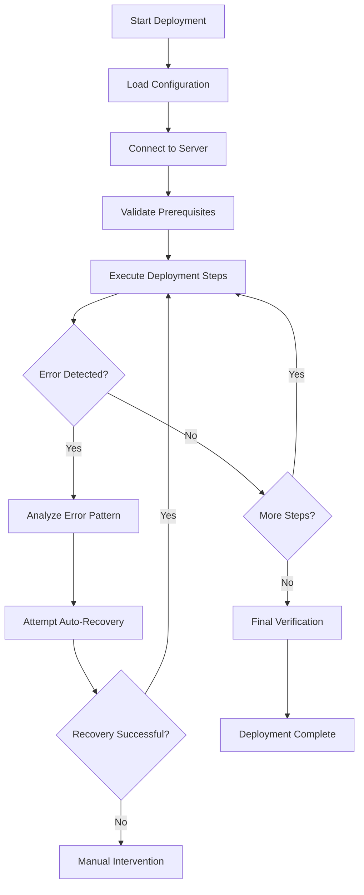

# AI-Driven Production Deployment Guide

## Overview

The ProjectMeats AI Deployment Orchestrator is an intelligent, autonomous production deployment system that can handle complex server setups, automatically recover from errors, and manage the entire deployment process with minimal human intervention.

## Key Features

### 🤖 Intelligent Error Detection & Recovery
- **Pattern Recognition**: Automatically detects common deployment errors using regex patterns
- **Smart Recovery**: Implements context-aware recovery strategies for different types of failures
- **Learning System**: Improves recovery strategies based on previous deployment experiences

### 🔄 Dynamic Terminal Session Management
- **Real-time Monitoring**: Continuously monitors command output and system responses
- **Interactive Handling**: Automatically responds to prompts and interactive installers
- **Session Persistence**: Maintains state across the entire deployment process

### 🛡️ Autonomous Error Handling
- **Auto-retry Logic**: Intelligent retry mechanisms with exponential backoff
- **Rollback Capabilities**: Automatic rollback on critical failures
- **Backup Management**: Creates automatic backups before major changes

### 📊 Comprehensive Monitoring
- **Real-time Logging**: Structured logging with multiple output formats
- **Progress Tracking**: Visual progress indicators and step-by-step status
- **Performance Metrics**: Tracks deployment time, success rates, and resource usage

## Quick Start

### 1. Setup the AI Deployment System

```bash
# Run the setup wizard
python setup_ai_deployment.py
```

This wizard will:
- Install required dependencies
- Setup SSH key authentication
- Configure server profiles
- Configure AI features and deployment settings
- Generate deployment templates

### 2. Deploy to Production

```bash
# Interactive deployment (recommended for first time)
./ai_deploy.sh --interactive

# Automated deployment
./ai_deploy.sh --server myserver.com --domain mydomain.com --auto

# Use a predefined server profile
./ai_deploy.sh --profile production
```

### 3. Monitor and Manage

```bash
# Test server connection
python ai_deployment_orchestrator.py --test-connection --server myserver.com

# Resume a failed deployment
python ai_deployment_orchestrator.py --resume --deployment-id abc123

# View deployment logs
tail -f logs/deployment_*.log
```

## Architecture

### Core Components

#### 1. AIDeploymentOrchestrator
The main orchestrator class that manages the entire deployment process:

```python
class AIDeploymentOrchestrator:
    - Connection management (SSH, SFTP)
    - Command execution with real-time monitoring
    - Error detection and recovery
    - State management and persistence
    - Logging and reporting
```

#### 2. Error Detection System
Pattern-based error detection with intelligent recovery:

```python
@dataclass
class ErrorPattern:
    pattern: str              # Regex pattern for error detection
    severity: ErrorSeverity   # Error severity level
    recovery_function: str    # Recovery function to call
    description: str          # Human-readable description
    retry_count: int = 3      # Number of retry attempts
```

#### 3. Deployment State Management
Persistent state tracking for resumable deployments:

```python
@dataclass
class DeploymentState:
    deployment_id: str        # Unique deployment identifier
    status: DeploymentStatus  # Current deployment status
    current_step: int         # Current deployment step
    total_steps: int          # Total number of steps
    server_info: Dict         # Server configuration
    error_count: int          # Number of errors encountered
    warnings: List[str]       # Warning messages
    start_time: datetime      # Deployment start time
    end_time: datetime        # Deployment end time
```

### Deployment Flow



## Configuration

### AI Deployment Configuration File

The system uses `ai_deployment_config.json` for configuration:

```json
{
  "version": "1.0",
  "ssh": {
    "key_file": "/path/to/ssh/key",
    "port": 22,
    "timeout": 30
  },
  "deployment": {
    "max_retries": 3,
    "retry_delay": 5,
    "command_timeout": 300,
    "auto_approve": false,
    "auto_recovery": true,
    "backup_on_failure": true
  },
  "ai_features": {
    "intelligent_error_detection": true,
    "auto_fix_common_issues": true,
    "learn_from_failures": true,
    "optimization_suggestions": true
  },
  "server_profiles": {
    "production": {
      "hostname": "prod.example.com",
      "username": "root",
      "domain": "myapp.com",
      "use_password": false,
      "key_file": "/path/to/key"
    }
  }
}
```

### Server Profile Configuration

Define multiple server profiles for different environments:

```json
{
  "development": {
    "hostname": "dev.example.com",
    "username": "deploy",
    "domain": "dev.myapp.com",
    "specs": {
      "cpu_cores": "2",
      "memory_gb": "4", 
      "storage_gb": "50"
    }
  },
  "staging": {
    "hostname": "staging.example.com",
    "username": "root",
    "domain": "staging.myapp.com",
    "specs": {
      "cpu_cores": "4",
      "memory_gb": "8",
      "storage_gb": "100"
    }
  },
  "production": {
    "hostname": "prod.example.com",
    "username": "root", 
    "domain": "myapp.com",
    "specs": {
      "cpu_cores": "8",
      "memory_gb": "16",
      "storage_gb": "200"
    }
  }
}
```

## Error Detection and Recovery

### Supported Error Patterns

The system automatically detects and recovers from common deployment issues:

| Error Pattern | Severity | Recovery Action |
|---------------|----------|-----------------|
| Node.js conflicts | High | Complete Node.js cleanup and reinstall |
| Package not found | Medium | Update package repositories |
| Permission denied | High | Fix file permissions and ownership |
| Database connection failed | High | Restart database service |
| Port already in use | Medium | Kill conflicting processes |
| Connection refused | High | Restart services |
| Disk space insufficient | Critical | Cleanup disk space |
| DNS resolution failed | Medium | Fix DNS configuration |
| SSL certificate failed | High | Retry certificate setup |
| NPM permission errors | Medium | Fix NPM permissions |

### Custom Error Recovery

You can add custom error patterns and recovery functions:

```python
# Add custom error pattern
custom_pattern = ErrorPattern(
    pattern=r"custom_error_pattern",
    severity=ErrorSeverity.HIGH,
    recovery_function="custom_recovery_function",
    description="Custom error description"
)

# Implement recovery function
def custom_recovery_function(self) -> bool:
    """Custom recovery implementation"""
    # Your recovery logic here
    return True
```

## Deployment Steps

The system executes the following deployment steps:

1. **validate_server**: Check server prerequisites and compatibility
2. **setup_authentication**: Configure authentication and security
3. **install_dependencies**: Install system packages and dependencies
4. **handle_nodejs_conflicts**: Resolve Node.js package conflicts
5. **setup_database**: Configure PostgreSQL database
6. **download_application**: Download ProjectMeats from GitHub
7. **configure_backend**: Setup Django backend with dependencies
8. **configure_frontend**: Build React frontend application
9. **setup_webserver**: Configure Nginx and SSL certificates
10. **setup_services**: Configure system services and monitoring
11. **final_verification**: Verify deployment success

Each step includes:
- **Pre-step validation**: Check prerequisites
- **Execution monitoring**: Real-time output monitoring
- **Error detection**: Pattern-based error detection
- **Auto-recovery**: Automatic error recovery attempts
- **State persistence**: Save progress for resumability

## Advanced Features

### Resumable Deployments

If a deployment fails, you can resume from the last successful step:

```bash
# Resume deployment with specific ID
python ai_deployment_orchestrator.py --resume --deployment-id abc123

# The system will:
# 1. Load the previous deployment state
# 2. Reconnect to the server
# 3. Continue from the last successful step
# 4. Apply any learned recovery strategies
```

### Real-time Monitoring

The system provides comprehensive real-time monitoring:

```bash
# Monitor deployment progress
tail -f logs/deployment_YYYYMMDD_HHMMSS.log

# Structured JSON logs
tail -f deployment_log.json | jq '.'

# Check deployment state
cat deployment_state.json | jq '.'
```

### State Persistence

All deployment state is persisted to enable resumability:

```json
{
  "deployment_id": "abc123",
  "status": "running",
  "current_step": 5,
  "total_steps": 11,
  "server_info": {
    "hostname": "myserver.com",
    "username": "root"
  },
  "error_count": 1,
  "warnings": ["Node.js conflict detected and resolved"],
  "start_time": "2024-01-01T10:00:00",
  "end_time": null
}
```

## Security Features

### SSH Key Management
- Automatic SSH key generation and management
- Support for multiple key types (RSA, Ed25519)
- Secure key storage and permissions

### Secure Communications
- Encrypted SSH connections with timeout handling
- Certificate validation and security headers
- Secure file transfers using SFTP

### Access Control
- Role-based access control for different environments
- Audit logging of all deployment actions
- Backup and rollback capabilities

## Troubleshooting

### Common Issues

#### Connection Failures
```bash
# Test connection
python ai_deployment_orchestrator.py --test-connection --server myserver.com

# Check SSH key permissions
chmod 600 ~/.ssh/id_ed25519
```

#### Deployment Failures
```bash
# Check logs for errors
grep ERROR logs/deployment_*.log

# Resume failed deployment
python ai_deployment_orchestrator.py --resume --deployment-id abc123

# Manual recovery
ssh user@server
# Fix issues manually, then resume deployment
```

#### Configuration Issues
```bash
# Validate configuration
python -c "import json; print(json.load(open('ai_deployment_config.json')))"

# Reset configuration
rm ai_deployment_config.json
python setup_ai_deployment.py
```

### Debug Mode

Enable debug mode for detailed logging:

```bash
# Set debug logging level
export LOG_LEVEL=DEBUG

# Run deployment with debug output
python ai_deployment_orchestrator.py --interactive --config debug_config.json
```

### Recovery Strategies

The system implements several recovery strategies:

1. **Immediate Retry**: For transient errors
2. **Service Restart**: For service-related issues
3. **Package Reinstall**: For dependency conflicts
4. **Configuration Reset**: For configuration issues
5. **Manual Intervention**: For complex issues requiring human input

## Performance Optimization

### Parallel Processing
- Concurrent command execution where possible
- Async I/O for real-time monitoring
- Efficient resource utilization

### Caching
- Command result caching
- Package installation caching
- Configuration template caching

### Resource Management
- Memory usage optimization
- Network bandwidth management
- Disk space monitoring

## Integration with Existing Tools

### GitHub Integration
- Automatic repository cloning
- Branch and tag selection
- Authentication with Personal Access Tokens

### CI/CD Integration
```yaml
# GitHub Actions example
- name: Deploy with AI Orchestrator
  run: |
    python setup_ai_deployment.py --auto
    ./ai_deploy.sh --server ${{ secrets.SERVER }} --domain ${{ secrets.DOMAIN }}
```

### Monitoring Integration
- Prometheus metrics export
- Grafana dashboard templates
- Slack/Discord notifications

## Support and Contributing

### Getting Help
1. Check the troubleshooting section
2. Review deployment logs
3. Create an issue with detailed information

### Contributing
1. Fork the repository
2. Add new error patterns or recovery functions
3. Improve documentation
4. Submit pull requests

## License

This AI deployment system is part of ProjectMeats and follows the same license terms.